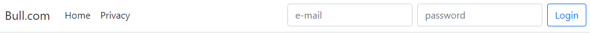
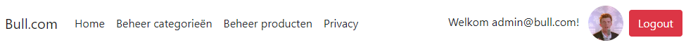
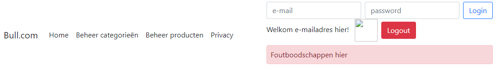
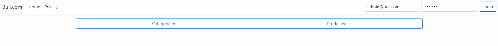

# Pri.Vue.Store - Admin login

- Clone deze repository; werk dus niet verder op de vorige oefening aangezien er enkele wijzigingen zijn gebeurd in de meegeleverde code
- Update je database met het passende commando.

In deze oefening is het de bedoeling dat een admin kan inloggen met volgende gegevens;
- email: admin@bull.com
- password: Test123?

Hiervoor zijn twee inputs en een button voorzien in de navigatie

---

---

Wanneer de admin is ingelogd:
- wordt zijn e-mail/username getoond in de navbar, alsook zijn profielfoto.
- worden twee links zichtbaar in de navigatie:
	- beheer categorieën
	- beheer producten
- wordt er een logout button getoond

---

---

## Vue.js
- Vue werd al geïnstalleerd in het MVC project, dus dit hoef je niet meer te installeren.
- Je vindt decode in de navigation.js file in de wwwroot/js folder
Werk de twee reeds aangemaakte methode properties (`submitLogin` en `submitLogout`) uit.

De nodige HTML met Bootstrap css klassen zijn reeds voorzien. Bij de start van deze oefening zal je alle HTML element zien, ook diegene die wel/niet zichtbaar mogen zijn. Aan jullie om alles aan te passen zodat het logisch is wat je wel of niet toont.

---

---

### Submit login
- Je stuurt spreekt het endpoint aan op de API `api/Authentication/login` en stuurt de nodige gegevens mee om de gebruiker in te loggen.
- Je bewaart de ontvangen Bearer token op in de **sessionstorage** van je browser.
- Je past de navigatie balk aan na een succesvolle inlogpoging
---

---

Het e-mailadres en de profielfoto zitten vervat in de claims van de token. Je kan deze decoderen door de reeds aanwezige function decodeToken te gebruiken. Voorzie eventueel
extra functions in de navigation.js om het emailadres en de profielfoto uit de token te halen.
### Submit Logout
- Je verwijdert de Bearer token uit de sessionstorage (je maakt de sessionstorage volledig leeg)
- Je past de navigatiebalk terug aan zodat het loginscherm weer zichtbaar wordt.

### WEB API endpoints
De communicatie met de WEB API gebeurt door middel van Axios methoden in de Vue implementatie.

Je gebruikt hiervoor onderstaande endpoints van de WEB API:

|Endpoint|Omschrijving|
|---|---|
|/api/Authentication/login|Inloggen met een e-mailadres en password|

## Voorbeeld uitwerking

